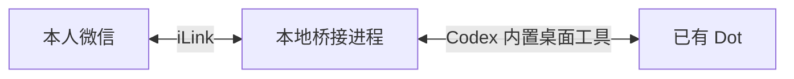

# WeDot


在微信中与已有的 Codex Dot 对话，并接收它的文字回复。

WeDot 是一个运行在本机的 Codex 插件：扫码绑定本人微信后，插件将微信消息转交给指定的 Dot，并把 Dot 发往 ChatGPT 的新增文字同步回微信。Dot 继续使用自己的身份、记忆、模型和权限。



## 功能

- **双向文字对话**：从微信发消息给 Dot，在微信接收回复。
- **同步新增回复**：Dot 在桌面对话中的文字回复和主动消息也会同步到微信。
- **扫码绑定本人**：只接受扫码确认的本人发送的消息。
- **连续上下文**：连接现有 Dot 的主对话，保留其记忆。
- **本地管理**：通过 Codex 完成连接、扫码、启停和状态检查。
- **消息恢复**：保存待处理队列、去重记录和同步游标。

当前仅支持 Dot 模式，不提供独立 Codex 会话或微信端会话切换。

## 使用前准备

| 条件 | 说明 |
| --- | --- |
| Windows | 当前提供 Windows 安装脚本；其他系统未做完整实机验证 |
| Node.js 22.12 或更新版本 | 用于运行插件的本地后台进程 |
| Codex 桌面应用 | 已登录，能够使用 Dot 和内置 app-tools 桌面工具 |
| 一个已有的 Dot | 先在 Codex 中打开它，确认它的名称 |
| 微信账号 | 能完成 iLink 微信助理的扫码绑定 |

需要保持电脑唤醒、Codex 桌面应用运行以及网络连接。此项目使用当前桌面版本提供的本地工具接口，桌面升级后可能需要适配。

## 安装教程

### 1. 获取源码

下载本仓库的 ZIP 并解压，或者克隆仓库。在 PowerShell 中进入包含 `install.ps1` 的项目根目录。

仓库自带 `dist/cli.js`，普通使用无需先安装 npm 依赖。如果下载的源码不含该文件，在项目目录依次运行 `npm ci` 和 `npm run build`，然后再安装。

### 2. 安装插件

在项目根目录运行：

```powershell
.\install.ps1
```

安装脚本会定位本机 Codex，将运行所需文件复制到当前用户的本地插件源目录，并注册、安装 `wedot@wedot-local`。

安装位置默认位于：

```text
~/.codex/plugin-sources/wedot-local/plugins/wedot
```

安装完成后，在 Codex 桌面应用中新开一个对话，让新对话加载插件技能。

### 3. 连接你的 Dot

在 Codex 对话中输入：

> 把 WeDot 连接到我的 Dot，并同步文字对话。

插件会确认你的 Dot 名称，匹配当前主 Dot 并检查是否能访问其主对话，然后显示微信登录二维码。

如果已经有一个桥接进程正在运行，先让 Codex 停止 WeDot，再连接目标 Dot。

### 4. 扫码并开始聊天

1. 用微信扫描 Codex 显示的二维码，在手机上确认登录。
2. 回到 Codex 告知“已扫码”，让它检查绑定并启动 WeDot。
3. 在微信助理会话中发送一条文字，例如“你好，请介绍一下你自己”。
4. 确认微信收到了 Dot 的回复。

第一条微信消息会建立回复所需的上下文。二维码最多等待 8 分钟，过期后重新登录即可。已完成的微信绑定通常可以复用，不必每次启动都扫码。

## 日常使用

可以直接在 Codex 中说：

| 需求 | 示例 |
| --- | --- |
| 查看连接 | “查看 WeDot 状态” |
| 启动转发 | “启动 WeDot” |
| 停止转发 | “停止 WeDot” |
| 重新连接 | “重新连接 WeDot 到我的 Dot” |
| 退出微信登录 | “停止 WeDot 并退出本地微信登录” |

微信端支持以下指令：

| 指令 | 行为 |
| --- | --- |
| `/status` | 查看桥接运行状态、Dot 连接状态和收发队列；不停止 Dot |
| `/help` | 查看功能和帮助 |
| `/new`、`/clear`、`/清空` | 提示保留现有 Dot 记忆，不会清空或创建新对话 |
| 其他 `/` 指令（包括 `/stop`、`/restart`、`/logout`） | 本地提示不支持，不转交给 Dot 执行 |

指令支持大小写、前后空白及全角斜杠，不接受参数；例如 `/STATUS` 和 `／status` 等同于 `/status`。所有以斜杠开头的指令均由本地插件处理，普通文字才会交给 Dot。指令回包与 Dot 回复共用顺序发送队列。桌面工具暂时不可用时会重试，微信指令仍可响应，普通消息保留在队列中等待恢复。

停止插件只会停止消息转发，不会取消 Dot 正在进行的工作。重启 Codex 后，请在 Codex 对话中重新执行停止和启动，使后台继承新的桌面工具连接。

## 同步范围

支持文字和微信已识别成文字的语音消息。长文字会分段发送，Dot 回复的检测通常使用约 20 秒的等待窗口，实际延迟还取决于模型处理和网络情况。

微信输入会作为转发请求进入 Dot 的核心会话，而不是其消息房间中的原生用户气泡。桌面端的用户输入气泡不会复制到微信；Dot 发往 ChatGPT 的新增文字回复会同步。首次连接建立历史基线，不会批量回传旧聊天。

以下内容暂不支持：图片、文件、实时音视频、远程权限审批、开机自启和微信端助理切换。内部推理、工具日志、其他渠道消息及结束占位词不会转发。

## 常见问题

| 现象 | 处理方法 |
| --- | --- |
| 提示“当前主 Dot 与指定名称不匹配” | 在 Codex 打开需要连接的 Dot，核对名称后重试 |
| 提示需要从 Codex 桌面对话启动 | 让 Codex 在对话中执行连接或启动，不要从普通终端直接启动转发 |
| 扫码二维码过期 | 重新运行 `login` 获取二维码 |
| 已连接 Dot，但微信没有回复 | 先在微信发一条新消息，再检查 `dotReplyReady`、`lastReceiveAt`、`lastForwardAt`、`lastReplyAt` 和 `lastSendError` |
| `/status` 没有回包 | 在 Codex 查看 `lastCommandAt`、`lastCommandReplyAt` 和 `lastSendError`，区分未收到指令与发送失败；同时确认 `workerVersion` 为当前版本 |
| 重启 Codex 后断开 | 在新的 Codex 工具环境中执行 `stop`、`start` |
| 微信接口返回 `-14` | 停止后重新扫码登录，再启动 |
| 进程意外退出后缺少某条回复 | 查看 Dot 原对话或重新发送；为避免重复执行，结果无法确认的请求不会自动重放 |
| 使用旧版本的独立 Codex 配置 | 先执行 `connect-dot --name NAME`；当前版本仅支持 Dot |

## 更新与卸载

更新前先让 Codex 停止 WeDot。获取新代码，确认构建产物存在，再运行 `install.ps1`。在新的 Codex 对话中检查连接并启动。

卸载前同样先停止转发，然后运行：

```powershell
codex plugin remove wedot@wedot-local
```

运行数据独立保存，卸载插件不会自动退出微信登录。如需删除本地凭证，应先执行 `logout` 再卸载。
